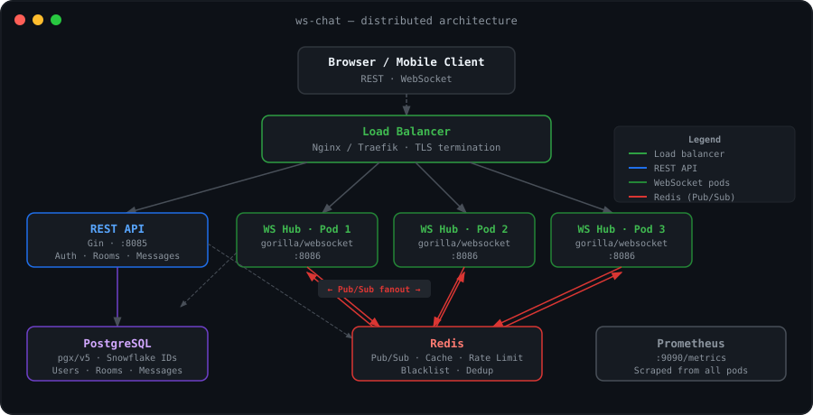

<p align="center">
  
</p>

<h1 align="center">ws-chat</h1>

<p align="center">
  A correctness-first, horizontally scalable WebSocket chat backend in Go.<br>
  RS256 JWT auth &nbsp;·&nbsp; Redis Pub/Sub cross-node fanout &nbsp;·&nbsp; PostgreSQL persistence &nbsp;·&nbsp; Kubernetes-ready at <code>replicas: 3</code>
</p>

<p align="center">
  <a href="https://github.com/sanskarpan/websocket-chat-pub-sub/actions/workflows/ci.yml"></a>&nbsp;
  <a href="https://golang.org"></a>&nbsp;
  &nbsp;
  <a href="https://sanskarpan.github.io/websocket-chat-pub-sub/"></a>&nbsp;
  <a href="LICENSE"></a>
</p>

---

Most WebSocket chat tutorials wire a single server and call it done. The moment you add a second pod, messages sent to users on *other* instances silently vanish. ws-chat solves that with a Redis Pub/Sub fanout layer — every pod subscribes to the same channels, so any pod can deliver any message to any connected client. No sticky sessions required.

The secondary goal is correctness under concurrency. Every message path is verified by `go test -race`, deduplication is distributed via Redis (not a per-pod `sync.Map`), and token revocation is enforced at validation time, not just at issuance.

---

## Quickstart

```bash
git clone https://github.com/sanskarpan/websocket-chat-pub-sub.git
cd websocket-chat-pub-sub

docker compose up -d          # PostgreSQL + Redis
bash scripts/generate_keys.sh # RSA-2048 JWT signing keys
go run cmd/server/main.go     # REST :8085 · WebSocket :8086 · Metrics :9090
```

```bash
go test -race ./...            # all 11 packages pass, zero data races
```

---

## In action

<p align="center">
  
</p>

---

## How it works

**Three independent HTTP servers** start from a single binary:

| Server | Port | Purpose |
|---|---|---|
| REST API | `:8085` | Gin — auth, rooms, messages |
| WebSocket Hub | `:8086` | gorilla/websocket — real-time connections |
| Metrics | `:9090` | Prometheus scrape target |

**The Hub** is a single goroutine owning `clients`, `rooms`, and `users` maps. All mutations go through its `register`, `unregister`, and `broadcast` channels — the Go channels-over-mutexes pattern applied strictly. Each client gets a read pump goroutine and a write pump goroutine, with a 256-message buffered send channel. Slow clients are dropped immediately — no goroutine leak, no unbounded memory growth.

**Redis Pub/Sub** is the cross-node glue. When Pod 1 receives a message, it persists to PostgreSQL, then publishes to `ws:room:<id>`. All pods — including Pod 1 — receive the event via their subscriptions and fan it out locally. Three channels cover all real-time events:

```
ws:room:<room_id>          →  messages, edits, deletes, reactions
ws:room:<room_id>:events   →  member joined / left
ws:presence                →  online / away / dnd / offline
```

Subscriptions reconnect with exponential backoff if Redis drops. PostgreSQL is the source of truth — a dropped Pub/Sub event means delayed delivery, never lost data.

---

## Authentication

**RS256 asymmetric JWT** — private key signs, public key verifies. The public key can be shared with edge proxies without granting signing ability.

Both access tokens (15 min) and refresh tokens (7 days) carry a `jti` UUID. On `POST /api/v1/auth/logout`, both JTIs are blacklisted in Redis with TTLs matching their remaining validity. `ValidateToken` checks the blacklist on every call — logout takes effect on the very next request, not at expiry. Refresh tokens are single-use; the old JTI is invalidated before a new pair is issued.

```http
POST /api/v1/auth/logout
Authorization: Bearer <access_token>
Content-Type: application/json

{"refresh_token": "<refresh_token>"}
```
```json
{"status": "logged_out"}
```

---

## REST API

```
GET  /healthz                         Liveness probe
GET  /readyz                          Readiness — 503 if DB or Redis is down

POST /api/v1/auth/register            Create account
POST /api/v1/auth/login               Authenticate, get token pair
POST /api/v1/auth/refresh             Rotate refresh token
POST /api/v1/auth/logout  🔒          Blacklist both JTIs immediately

GET  /api/v1/rooms        🔒          List rooms you belong to
POST /api/v1/rooms        🔒          Create room (direct / group / channel)
GET  /api/v1/rooms/:id    🔒          Room details
GET  /api/v1/rooms/:id/messages 🔒   Paginated history (?limit=N&before=RFC3339)
POST /api/v1/rooms/:id/join     🔒   Join (404 not found · 403 banned)
POST /api/v1/rooms/:id/leave    🔒   Leave
```

`🔒` = requires `Authorization: Bearer <access_token>`. Rate-limited endpoints return `Retry-After` on `429`.

---

## WebSocket protocol

Connect with the access token as a query parameter:

```
ws://host:8086/ws?token=<access_token>
```

All frames use the same envelope:

```json
{"id": "...", "type": "<type>", "timestamp": "2026-01-01T00:00:00Z", "data": { ... }}
```

**Client → Server**

| Type | Action |
|---|---|
| `subscribe` | Subscribe to rooms (`room_ids`) and presence (`presence_subscribe`) |
| `unsubscribe` | Unsubscribe from rooms |
| `message` | Send a message — include `client_id` for dedup-safe retries |
| `edit` / `delete` | Edit or delete a message |
| `reaction` | Add or remove an emoji reaction |
| `typing` / `read_receipt` / `presence` | Indicators and status |
| `ping` | Keep-alive |

**Server → Client**

`connection` · `ack` · `error` · `new_message` · `message_updated` · `typing` · `reaction` · `presence` · `read_receipt` · `member_joined` · `member_left` · `pong`

Full protocol reference: [docs/websocket-protocol.md](docs/websocket-protocol.md)

---

## Security

| Control | Implementation |
|---|---|
| RS256 JWT | RSA-2048 asymmetric keys; auto-generated in dev, env-injected in prod |
| Token revocation | Both JTIs blacklisted in Redis on logout — effective immediately |
| Refresh rotation | Each refresh token is single-use; old JTI invalidated before new pair issued |
| Rate limiting | Sliding-window Lua script in Redis; fail-closed on Redis outage; `Retry-After` on 429 |
| CORS | Config-driven (`cfg.Server.Websocket.AllowedOrigins`) — not hardcoded |
| Password hashing | bcrypt cost 12; dummy hash run on unknown-email login to normalize timing |
| XSS | Script tags stripped + HTML entity escape before persistence and broadcast |
| Dedup | `client_id` checked against Redis `SET NX EX 300` — works across all pods |
| Domain errors | `ErrRoomNotFound` → 404, `ErrUserBanned` → 403; no 500 leakage |

---

## Configuration

All settings in `configs/config.yaml`, overridable via environment variables:

```bash
APP_ENVIRONMENT=production   # enforces explicit JWT keys + DB password
JWT_PRIVATE_KEY=<PEM>        # RSA private key content
JWT_PUBLIC_KEY=<PEM>         # RSA public key content
DB_PASSWORD=<password>       # PostgreSQL password
REDIS_ADDR=host:6379         # Redis address
```

Full reference: [docs/configuration.md](docs/configuration.md)

---

## Deployment

```bash
# Docker
docker build -t websocket-chat:latest .
docker run -p 8085:8085 -p 8086:8086 -p 9090:9090 \
  -e APP_ENVIRONMENT=production \
  -e JWT_PRIVATE_KEY="$(cat configs/jwt-private.pem)" \
  -e JWT_PUBLIC_KEY="$(cat configs/jwt-public.pem)" \
  -e DB_PASSWORD="..." \
  websocket-chat:latest

# Kubernetes (replicas: 3 — no sticky sessions needed)
kubectl apply -f deployments/kubernetes/
kubectl get pods,services
```

No sticky sessions — any pod handles any client and delivers all messages via Redis fanout. Set `terminationGracePeriodSeconds: 35` to give the 30-second graceful drain enough time.

Full manifests + TLS + secrets: [docs/deployment.md](docs/deployment.md)

---

## Observability

| Metric | Type |
|---|---|
| `websocket_connections_active` | Gauge |
| `websocket_messages_sent_total` | Counter |
| `auth_attempts_total{status}` | Counter |
| `rate_limited_requests_total{key}` | Counter |
| `db_query_duration_seconds` | Histogram |
| `redis_operation_duration_seconds` | Histogram |

Scrape `:9090/metrics`. Health probes: `GET /healthz` (liveness) and `GET /readyz` (readiness — 503 if DB or Redis is down). Logs are structured JSON via zerolog with `request_id`, `component`, `duration_ms`.

Full metrics, alerting rules, and Grafana panel queries: [docs/monitoring.md](docs/monitoring.md)

---

## Testing

```bash
go test -race ./...                       # unit + integration, no infra needed

# E2E (requires docker compose up -d first)
go test -race -v -tags=e2e ./test/e2e/...
```

**11 packages · 0 data races · 3 test layers:**

- **Unit** (`internal/...`) — fake in-memory repos, real services; covers auth blacklisting, JTI revocation, token rotation, dedup, sentinel error mapping, Hub shutdown under concurrency
- **Integration** (`test/integration`) — real Gin router + real services + fake repos; 9 tests including logout → 401 verification and JoinRoom 404/403 correctness
- **E2E** (`test/e2e`, `//go:build e2e`) — live server; includes `TestE2E_Logout` with 5 sub-tests

---

## Project structure

```
cmd/server/main.go        entry point — wires deps, starts 3 servers
internal/
  config/                 YAML config + env overrides + production validation
  handlers/               HTTP handlers (30+ tests in handlers_test.go)
  middleware/             CORS, rate-limit (sliding window), auth, request-ID
  model/                  User · Room · Message · Presence domain types
  protocol/               WebSocket message types and constants
  pubsub/                 Redis Pub/Sub + rate limit Lua + dedup + presence
  repository/             PostgreSQL via pgx/v5
  server/                 WebSocket Hub + Client (read/write pumps)
  service/                AuthService · RoomService · MessageService
pkg/
  sanitization/           XSS strip + HTML entity escape
  snowflake/              Snowflake ID generator
test/
  e2e/                    E2E tests (//go:build e2e)
  integration/            Integration tests
configs/config.yaml       Full application configuration
deployments/kubernetes/   k8s deployment, service, HPA manifests
docs/                     GitHub Pages source (MkDocs Material)
```

---

## Documentation

Full documentation at **[sanskarpan.github.io/websocket-chat-pub-sub](https://sanskarpan.github.io/websocket-chat-pub-sub/)**

| | |
|---|---|
| [Quickstart](docs/quickstart.md) | Clone → docker compose → first WebSocket message in 5 min |
| [Architecture](docs/architecture.md) | Hub/client pattern, Redis fanout, data flow diagrams |
| [REST API](docs/rest-api.md) | Full endpoint reference with request/response examples |
| [WebSocket Protocol](docs/websocket-protocol.md) | All C2S/S2C types, sequence diagrams, error codes |
| [Authentication](docs/authentication.md) | RS256, JTI blacklisting, logout, refresh rotation |
| [Configuration](docs/configuration.md) | Every knob, env override, production checklist |
| [Deployment](docs/deployment.md) | Docker, Kubernetes, TLS, rolling updates |
| [Monitoring](docs/monitoring.md) | Prometheus metrics, alerting rules, pprof |
| [Security](docs/security.md) | Full threat model and security control inventory |
| [Testing](docs/testing.md) | Unit, integration, E2E layers with fake patterns |
| [Runbook](docs/runbook.md) | On-call playbook — 6 failure modes with diagnosis steps |
| [ADR Index](docs/adr/index.md) | 4 architecture decision records |

---

## License

MIT — see [LICENSE](LICENSE)
