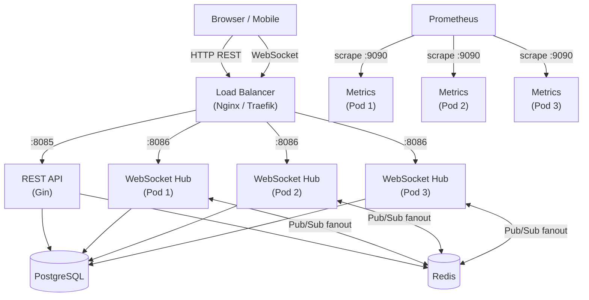
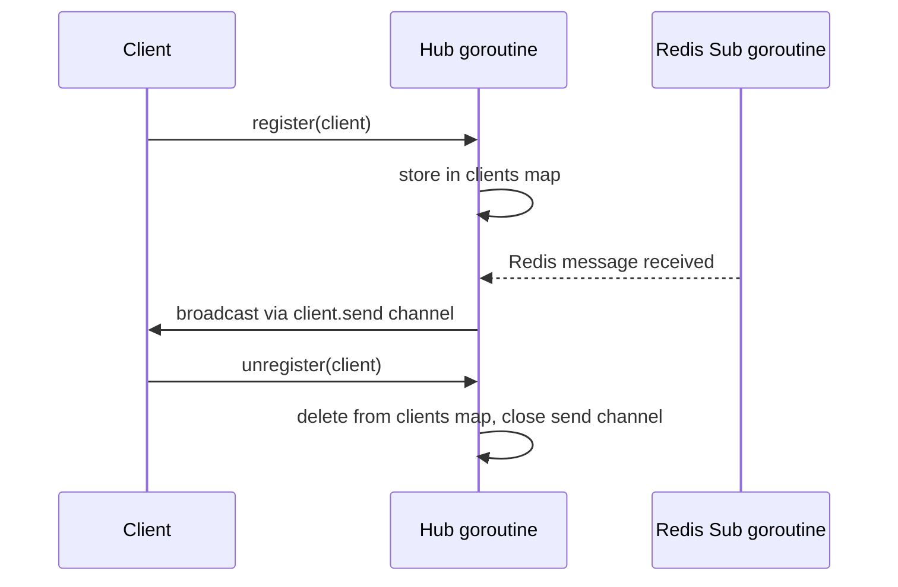
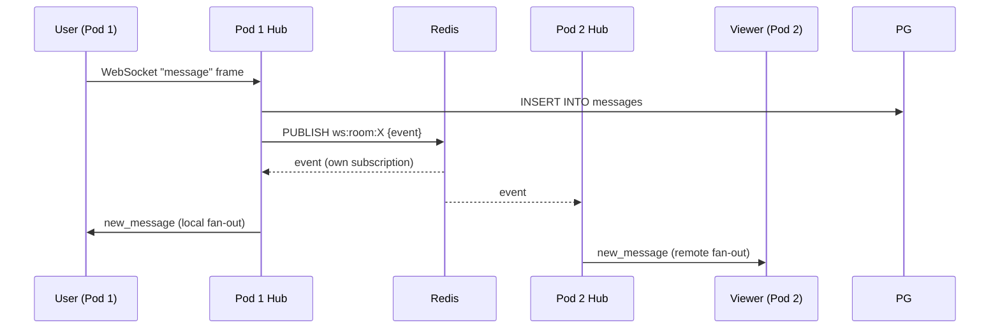
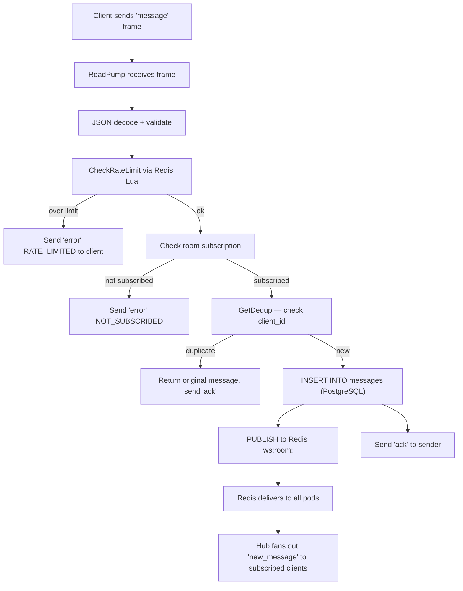

# System Architecture

A single binary launches three independent HTTP servers. Redis Pub/Sub connects multiple replicas so any pod can receive any message.

---

## High-level diagram



---

## Server components

Three `net/http` servers launch from the same binary inside `cmd/server/main.go`:

| Server | Port | Router | Purpose |
|---|---|---|---|
| REST API | `8085` | Gin | Auth, rooms, messages — synchronous request/response |
| WebSocket Hub | `8086` | `gorilla/websocket` | Real-time bidirectional connections |
| Metrics | `9090` | `net/http` | Prometheus scrape target (`/metrics`) |

All three share the same service layer and connection pools. There is no inter-server IPC: the only shared state lives in PostgreSQL and Redis.

---

## Hub / Client pattern



`Hub` is the single goroutine that owns the `clients`, `rooms`, and `users` maps. It never shares these maps with other goroutines — all mutations go through its `register`, `unregister`, and `broadcast` channels. This is the Go channels-over-mutexes idiom applied strictly.

Each `Client` has:
- A read pump goroutine (reads from the WebSocket, writes to the Hub's channels)
- A write pump goroutine (reads from `client.send`, writes to the WebSocket)
- A buffered `send` channel (256 messages)

If `send` fills up (slow client), the hub closes the connection immediately — no goroutine leak, no unbounded memory growth.

---

## Redis Pub/Sub fanout

The key insight: every WebSocket pod subscribes to the same Redis channels. When Pod 1 receives a message from a user, it:

1. Persists to PostgreSQL
2. Publishes the serialized event to `ws:room:<room_id>` on Redis
3. All pods (including Pod 1) receive the event via their Redis subscription
4. Each pod fans the event out to local clients subscribed to that room



Redis Pub/Sub channels used:

| Channel | Event types |
|---|---|
| `ws:room:<room_id>` | `new_message`, `message_updated` (edit/delete), reactions |
| `ws:room:<room_id>:events` | `member_joined`, `member_left` |
| `ws:presence` | `presence` (online/away/dnd/offline) |

---

## Distributed deduplication

A client sends a `client_id` field with each message. Before persisting, the service calls `pubsub.SetDedup(ctx, clientID, userID)` which does a Redis `SET NX EX 300` (5 minutes). If the key already exists, the original message is returned instead of creating a duplicate.

This is correct under k8s `replicas: 3` because Redis is the shared dedup store — not a per-pod `sync.Map`.

---

## Redis key inventory

| Key pattern | Type | TTL | Purpose |
|---|---|---|---|
| `ratelimit:<key>` | Sorted Set | window duration | Sliding-window rate limit counters |
| `presence:<user_id>` | String (JSON) | 5 min | User presence state |
| `blacklist:<jti>` | String | token TTL | Revoked JWT IDs |
| `dedup:<client_id>:<user_id>` | String | 5 min | Message dedup |
| `room:<id>` | String (JSON) | 5 min | Room object cache |

---

## Data flow: send a message



---

## Graceful shutdown sequence

On `SIGINT` or `SIGTERM`, the ordered shutdown runs inside a 30-second context:

1. Stop accepting new HTTP connections (REST API)
2. Call `wsServer.Shutdown` — send WebSocket close frames, wait for write pumps to flush
3. Shutdown REST API server and Metrics server
4. Wait for background Redis subscription goroutines to exit
5. Close Redis client connections
6. Close PostgreSQL connection pool (`db.Close()`)

This order ensures: no new work is accepted before existing work drains, and dependencies are closed last. See [ADR 0003](adr/0003-graceful-shutdown-and-connection-draining.md).

---

## Package layout

```
cmd/server/main.go           ← entry point: wires all dependencies, starts servers
internal/
  config/                    ← YAML config loading + env var overrides + validation
  handlers/                  ← HTTP handlers (REST endpoints)
  logging/                   ← zerolog structured JSON logging setup
  metrics/                   ← Prometheus metric definitions
  middleware/                 ← CORS, rate-limit, auth, request-ID middleware
  model/                     ← domain types: User, Room, Message, Presence
  protocol/                  ← WebSocket message types and constants
  pubsub/                    ← Redis Pub/Sub + rate limit + dedup + presence
  repository/                ← PostgreSQL data access layer (pgx/v5)
  server/                    ← WebSocket Hub + Client (read/write pumps)
  service/                   ← business logic: AuthService, RoomService, MessageService
  tracing/                   ← OpenTelemetry span helpers
pkg/
  sanitization/              ← XSS strip + HTML entity escape
  snowflake/                 ← Snowflake ID generator (unique message IDs)
```
