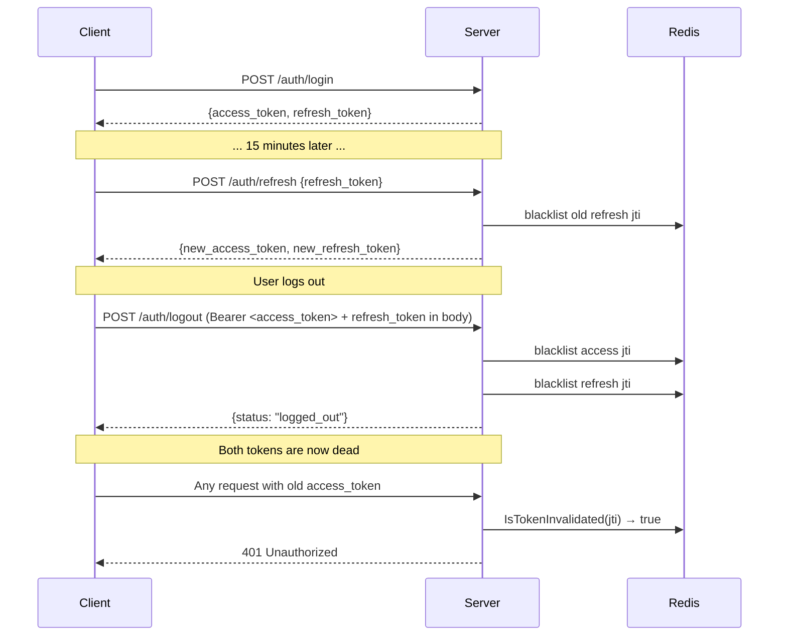

# Authentication

JWT RS256 with per-token JTI blacklisting and refresh token rotation.

---

## Token types

| Type | TTL | Contains | Used for |
|---|---|---|---|
| Access token | 15 min | `sub`, `jti`, `iss`, `aud`, `type: "access"` | REST API and WebSocket auth |
| Refresh token | 7 days | `sub`, `jti`, `iss`, `aud`, `type: "refresh"` | Obtaining new token pairs |

Both tokens carry a `jti` (JWT ID) — a UUID generated at issuance. This is what gets blacklisted on logout.

---

## RS256 signing

The server uses **RSA-2048 asymmetric key pairs**:

- Private key (`configs/jwt-private.pem`) — signs tokens at issuance
- Public key (`configs/jwt-public.pem`) — verifies tokens at validation

Private keys are never shared outside the server. In production, inject them via environment variables:

```bash
export JWT_PRIVATE_KEY="$(cat /run/secrets/jwt-private.pem)"
export JWT_PUBLIC_KEY="$(cat /run/secrets/jwt-public.pem)"
```

**Why RS256, not HS256?** RSA asymmetric signing means verification (public key) can be delegated to edge services without sharing the signing secret. It also enables future migration to a separate auth service without breaking existing validators. See [ADR 0001](adr/0001-jwt-authentication-and-authorization.md).

---

## Token lifecycle



---

## Token validation

Every call to `authService.ValidateToken` runs:

1. Parse and verify RS256 signature
2. Check `exp` claim (token not expired)
3. Check `type` claim (access vs refresh)
4. Check `jti` against Redis blacklist → if found, reject with `401`

This runs on every authenticated HTTP request and on every WebSocket upgrade. There is no in-memory whitelist or "fast path" that skips the blacklist check.

---

## Logout

`POST /api/v1/auth/logout` requires a valid access token in the `Authorization: Bearer` header. The logout handler:

1. Extracts the access token from the `Authorization` header
2. Parses the access token **without signature verification** (using `jwt.Parser.ParseUnverified`) to extract its `jti`
3. Blacklists the access token's `jti` in Redis with TTL = access token TTL
4. If a `refresh_token` is present in the request body, extracts and blacklists its `jti` with TTL = refresh token TTL
5. Returns `200 {"status": "logged_out"}`

`ParseUnverified` is used intentionally — the access token may be nearly expired, and we want to be able to revoke it even if signature validation fails due to clock skew. The `AuthMiddleware` on the route already validated the token before the handler runs, so the revocation itself doesn't need to re-verify the signature.

---

## WebSocket authentication

WebSocket connections pass the access token as a query parameter:

```
ws://host:8086/ws?token=<access_token>
```

The server validates the token (same checks as REST) before upgrading the connection. There is no separate WebSocket auth flow.

!!! warning "Token in URL"
    Query parameters can appear in server access logs and browser history. In production, use WSS (TLS) to mitigate eavesdropping. Consider switching to a short-lived one-time ticket issued by `POST /auth/ws-ticket` if your threat model requires tokens out of logs.

---

## Refresh token rotation

On every `POST /api/v1/auth/refresh`:

1. Validate the incoming refresh token (signature + expiry + jti blacklist)
2. Blacklist the old refresh token's `jti`
3. Issue a new access token and a new refresh token
4. Return the new pair

This means a refresh token can only be used once. If an attacker steals and uses a refresh token, the legitimate user's next refresh attempt will fail (the `jti` is already blacklisted) — a detectable signal.

---

## Key generation

```bash
# Generate a 2048-bit RSA key pair (script included in the repo)
bash scripts/generate_keys.sh
# Writes: configs/jwt-private.pem, configs/jwt-public.pem
```

Or manually:

```bash
openssl genrsa -out configs/jwt-private.pem 2048
openssl rsa -in configs/jwt-private.pem -pubout -out configs/jwt-public.pem
```

---

## Production checklist

- [ ] Inject keys via environment variables or a secrets manager — never commit them
- [ ] Set `APP_ENVIRONMENT=production` — this enforces that JWT keys are explicitly configured
- [ ] Use WSS (TLS) for all WebSocket connections — tokens in query strings need transport encryption
- [ ] Monitor `auth_attempts_total{status="failure"}` in Prometheus — spike = potential credential stuffing
- [ ] Set a short access token TTL (≤ 15 minutes) — limits exposure window if a token is leaked
- [ ] Rotate RSA keys periodically; use the blacklist period to bridge old → new key pairs
