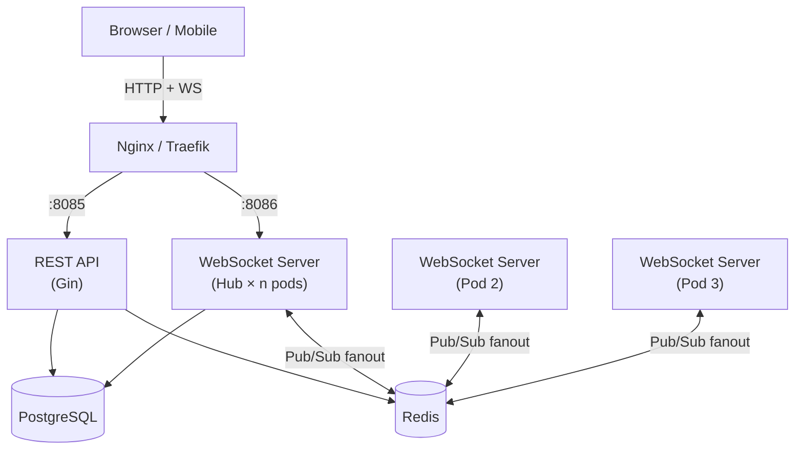

# ws-chat

A correctness-first, **horizontally scalable** WebSocket pub/sub engine for Go.

> Real-time chat with RS256 JWT auth, Redis cross-node fanout, PostgreSQL persistence, and Prometheus observability — ready to run on Kubernetes at `replicas: 3`.

---

## Why this exists

Most WebSocket chat tutorials wire a single server and call it done. The moment you add a second replica, messages sent to users on *other* instances silently vanish. This project solves that with a Redis Pub/Sub fanout layer so every pod sees every event — no sticky sessions required.

The secondary goal is correctness under concurrency. Every message path is covered by the race detector (`go test -race`), deduplication is distributed via Redis (not a single pod's `sync.Map`), and token revocation is enforced at validation time, not just at issuance.

---

## Core guarantees

| Property | Mechanism |
|---|---|
| Stateless auth | RS256 JWT — no per-request DB lookup for validation |
| Token revocation | Access **and** refresh jtis blacklisted in Redis on logout |
| Cross-node broadcast | Redis Pub/Sub `ws:room:<id>` + `ws:presence` channels |
| Distributed dedup | Client `client_id` field checked against Redis, not in-memory |
| Rate limiting | Sliding-window Lua script in Redis; `Retry-After` header on 429 |
| Zero message drop on redeploy | Ordered graceful shutdown with 30 s drain timeout |
| No data races | All concurrency paths verified by `go test -race` in CI |

---

## Start here

- :material-rocket-launch: **[Quickstart](quickstart.md)**

    Up and running in under 5 minutes with Docker Compose.

- :material-cog: **[Configuration](configuration.md)**

    Every knob — server, auth, database, Redis, rate limits, observability.

- :material-draw: **[Architecture](architecture.md)**

    Hub/client pattern, Redis fanout, k8s horizontal scaling, data flow.

- :material-api: **[REST API](rest-api.md)**

    Auth, rooms, messages — full request/response reference with examples.

- :material-connection: **[WebSocket Protocol](websocket-protocol.md)**

    Message envelope, all C2S and S2C types, subscription model, error codes.

- :material-shield-lock: **[Authentication](authentication.md)**

    RS256 JWT, token rotation, blacklisting, logout, WebSocket auth flow.

---

## Architecture in 30 seconds

Three independent HTTP servers launch from a single binary:

| Port | Server | Purpose |
|------|--------|---------|
| `8085` | REST API | Auth, rooms, messages |
| `8086` | WebSocket Hub | Real-time connections |
| `9090` | Metrics | Prometheus scrape target |

---

## Design records

The four ADRs capture the non-obvious design choices:

| ADR | Decision |
|-----|----------|
| [0001 — JWT Auth & RS256](adr/0001-jwt-authentication-and-authorization.md) | RS256 asymmetric signing, `jti` on all token types, blacklist on logout |
| [0002 — Redis Pub/Sub & Dedup](adr/0002-redis-pubsub-and-presence.md) | Cross-node fanout, distributed deduplication via Redis `GetDedup`/`SetDedup` |
| [0003 — Graceful Shutdown](adr/0003-graceful-shutdown-and-connection-draining.md) | Ordered shutdown: WS Hub → REST API → Metrics → Redis → PostgreSQL |
| [0004 — Token Blacklisting](adr/0004-token-blacklisting-and-logout.md) | `POST /auth/logout` blacklists both jtis; `validateToken` enforces on every call |

---

## Operations

- :material-docker: **[Deployment](deployment.md)**

    Docker, Docker Compose, Kubernetes manifests, TLS, secrets management.

- :material-chart-line: **[Monitoring](monitoring.md)**

    Prometheus metrics, health endpoints, structured JSON logging, tracing.

- :material-flask: **[Testing](testing.md)**

    Unit, integration, end-to-end (`//go:build e2e`), race detector.

- :material-book-open: **[Runbook](runbook.md)**

    On-call playbook — failure modes, rollback, escalation.

---

*This site is generated with [MkDocs Material](https://squidfunk.github.io/mkdocs-material/) from the markdown in `docs/`.*
