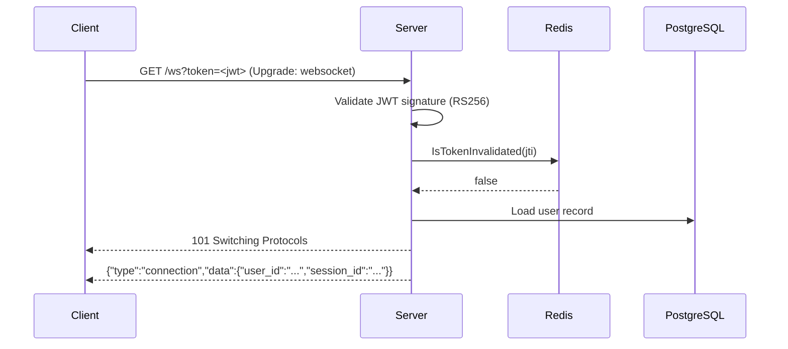
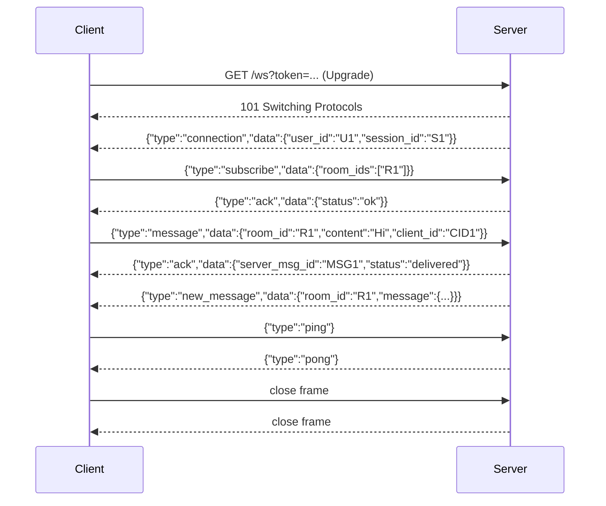

# WebSocket Protocol

All real-time events use a single WebSocket connection authenticated via JWT.

---

## Connection

```
ws://host:8086/ws?token=<access_token>
```

The `token` query parameter must be a valid, non-expired, non-revoked access JWT. The server validates the signature, checks the `jti` blacklist in Redis, and rejects the upgrade with `401` if either check fails.

Connection limit: **10 concurrent WebSocket connections per IP** (configurable via `server.websocket.max_connections_per_ip`).

### Upgrade sequence



If the token is invalid or revoked, the server returns `401` and closes the connection before upgrading.

---

## Message envelope

Every frame (both directions) uses the same JSON envelope:

```json
{
  "id": "snowflake-or-client-generated-id",
  "type": "<message-type>",
  "timestamp": "2026-01-01T00:00:00Z",
  "data": { ... }
}
```

| Field | Type | Notes |
|---|---|---|
| `id` | string | Client-generated for C2S; server-generated Snowflake ID for S2C |
| `type` | string | See tables below |
| `timestamp` | RFC3339 | ISO 8601 with timezone |
| `data` | object | Type-specific payload |

---

## Client-to-server (C2S) messages

### `subscribe`

Subscribe to one or more rooms and optionally track presence for specific users. The client must be a member of each room.

```json
{
  "type": "subscribe",
  "data": {
    "room_ids": ["room-uuid-1", "room-uuid-2"],
    "presence_subscribe": ["user-uuid-1"]
  }
}
```

Server responds with `ack`. Messages for non-member rooms are rejected with `error` code `FORBIDDEN`.

### `unsubscribe`

```json
{
  "type": "unsubscribe",
  "data": {
    "room_ids": ["room-uuid-1"]
  }
}
```

### `message`

Send a chat message. Maximum content length is **4,000 characters**.

```json
{
  "type": "message",
  "data": {
    "room_id": "room-uuid",
    "content": "Hello world!",
    "client_id": "client-generated-dedup-uuid",
    "parent_id": "optional-thread-parent-snowflake-id"
  }
}
```

`client_id` is optional but strongly recommended. When provided, the server deduplicates against it for 5 minutes — safe to retry on reconnect without creating duplicate messages.

### `typing`

```json
{
  "type": "typing",
  "data": {"room_id": "room-uuid", "user_id": "user-uuid"}
}
```

### `read_receipt`

```json
{
  "type": "read_receipt",
  "data": {"room_id": "room-uuid", "message_id": "msg-snowflake", "user_id": "user-uuid"}
}
```

### `reaction`

```json
{
  "type": "reaction",
  "data": {
    "room_id": "room-uuid",
    "message_id": "msg-snowflake",
    "emoji": "👍",
    "action": "add",
    "user_id": "user-uuid"
  }
}
```

`action` is `"add"` or `"remove"`.

### `edit`

Only the message author may edit. Content is XSS-sanitized before persistence.

```json
{
  "type": "edit",
  "data": {
    "room_id": "room-uuid",
    "message_id": "msg-snowflake",
    "content": "Updated content"
  }
}
```

### `delete`

Authors may delete their own messages. Room admins and owners may delete any message.

```json
{
  "type": "delete",
  "data": {"room_id": "room-uuid", "message_id": "msg-snowflake"}
}
```

### `presence`

Update the authenticated user's presence status.

```json
{
  "type": "presence",
  "data": {"status": "away"}
}
```

Valid statuses: `online`, `away`, `dnd`, `offline`.

### `ping`

Keep-alive. Server responds with `pong`. Use this if the client-side ping interval is not handled automatically.

```json
{"type": "ping", "data": {}}
```

---

## Server-to-client (S2C) messages

### `connection`

Sent immediately after a successful WebSocket upgrade.

```json
{
  "id": "srv-001",
  "type": "connection",
  "timestamp": "2026-01-01T00:00:00Z",
  "data": {"user_id": "user-uuid", "session_id": "session-uuid"}
}
```

### `ack`

Acknowledgement for `subscribe`, `message`, `edit`, `delete`.

```json
{
  "type": "ack",
  "data": {
    "client_msg_id": "client-generated-id",
    "server_msg_id": "snowflake-id-of-persisted-message",
    "status": "delivered"
  }
}
```

`server_msg_id` is only present for `message` acks.

### `error`

```json
{
  "type": "error",
  "data": {
    "client_msg_id": "client-generated-id",
    "code": "RATE_LIMITED",
    "message": "Too many messages. Please slow down.",
    "retry_after": 30
  }
}
```

`retry_after` (seconds) is only present for `RATE_LIMITED` errors.

### `new_message`

Broadcast to all clients subscribed to the room when a new message is created.

```json
{
  "type": "new_message",
  "data": {
    "room_id": "room-uuid",
    "message": {
      "id": "snowflake-id",
      "room_id": "room-uuid",
      "user_id": "user-uuid",
      "content": "Hello world!",
      "content_type": "text",
      "created_at": "2026-01-01T00:00:00Z",
      "reactions": {}
    }
  }
}
```

### `message_updated`

Broadcast on edit or delete.

```json
{
  "type": "message_updated",
  "data": {
    "room_id": "room-uuid",
    "message": { ... },
    "action": "edited"
  }
}
```

`action` is `"edited"` or `"deleted"`.

### `typing`

```json
{
  "type": "typing",
  "data": {"room_id": "room-uuid", "user_id": "user-uuid"}
}
```

### `reaction`

```json
{
  "type": "reaction",
  "data": {
    "room_id": "room-uuid",
    "message_id": "msg-snowflake",
    "emoji": "👍",
    "action": "add",
    "user_id": "user-uuid"
  }
}
```

### `presence`

```json
{
  "type": "presence",
  "data": {"user_id": "user-uuid", "status": "online", "presence": { ... }}
}
```

### `read_receipt`

```json
{
  "type": "read_receipt",
  "data": {"room_id": "room-uuid", "message_id": "msg-snowflake", "user_id": "user-uuid"}
}
```

### `member_joined` / `member_left`

```json
{"type": "member_joined", "data": {"room_id": "room-uuid", "user_id": "user-uuid"}}
{"type": "member_left",   "data": {"room_id": "room-uuid", "user_id": "user-uuid"}}
```

### `pong`

Response to `ping`.

```json
{"type": "pong", "data": {}}
```

---

## Error codes

| Code | Trigger |
|---|---|
| `UNKNOWN_TYPE` | Frame `type` field not recognized |
| `INVALID_INPUT` | Missing or malformed required fields in `data` |
| `CONTENT_TOO_LONG` | Message `content` exceeds 4,000 characters |
| `FORBIDDEN` | User is not a member of the target room |
| `NOT_SUBSCRIBED` | Sending a message to a room not yet subscribed |
| `RATE_LIMITED` | Rate limit exceeded; `retry_after` gives cooldown seconds |
| `EDIT_FAILED` | Edit rejected (not the author, or message not found) |
| `DELETE_FAILED` | Delete rejected (insufficient permissions, or message not found) |

---

## Full session example


